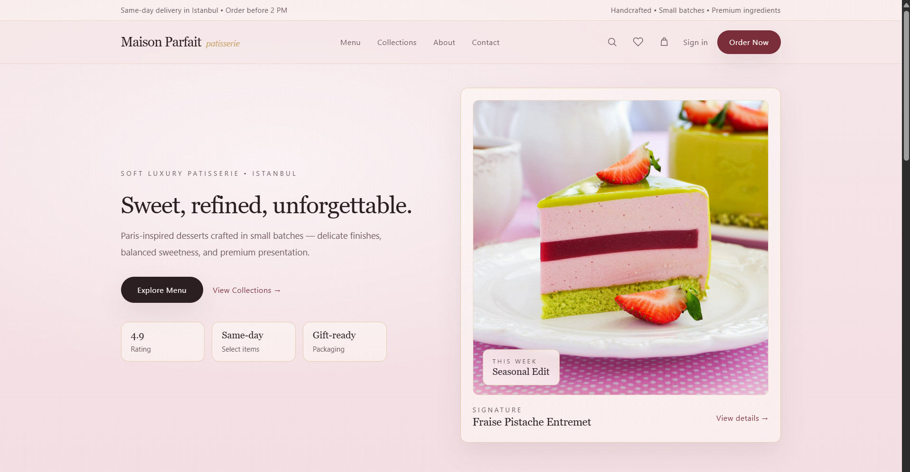
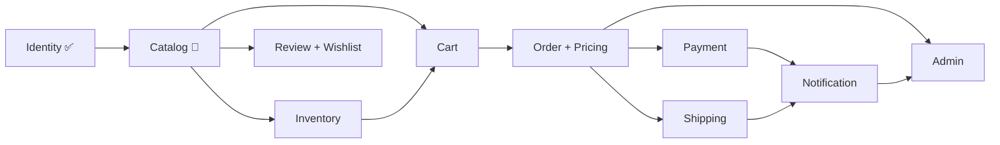

# Maison Parfait


> **Maison Parfait** is a fictional French patisserie e-commerce platform — a personal portfolio project for practicing production-style, full-stack delivery. The backend is a modular monolith built one phase at a time, with a matching frontend slice shipped alongside each phase. It's not a real business and isn't intended for public or commercial use.

## Contents

- [Preview](#preview)
- [Stack](#stack)
- [Architecture](#architecture)
- [Status](#status)
- [Running locally](#running-locally)
- [Tests](#tests)
- [Author](#author)
- [License](#license)

## Preview


*Hero section*


*Featured products and collections*

## Stack

| Layer    | Technologies                                                                                      |
| -------- | --------------------------------------------------------------------------------------------------|
| Backend  | Spring Boot 4.1.0, Java 21, PostgreSQL, Flyway, Spring Security, JWT, Spring Modulith, MapStruct, Testcontainers |
| Frontend | React 19, Vite, Tailwind CSS                                                                       |
| Infra    | Docker Compose (Postgres, pgAdmin, backend)                                                        |

## Architecture

The backend is built one module at a time, with each module completed and stabilized before the next one starts. Full design decisions and rationale live in:

- [`docs/backend-architecture.md`](docs/backend-architecture.md) — overall module map, database design, payment/shipping abstractions, and the phased roadmap
- [`docs/identity-module-design.md`](docs/identity-module-design.md) — authentication, sessions, and token design for the identity module

**Module dependency flow:**



## Status

| Phase | Module             | Backend    | Frontend   |
| ----- | ------------------ | ---------- | ---------- |
| 1     | Identity            | ✅ Done    | ✅ Done    |
| 2     | Catalog             | 🚧 Next    | 🚧 Next    |
| 3     | Inventory           | ⬜ Planned | ⬜ Planned |
| 4     | Cart                | ⬜ Planned | ⬜ Planned |
| 5     | Order + Pricing     | ⬜ Planned | ⬜ Planned |
| 6     | Payment             | ⬜ Planned | ⬜ Planned |
| 7     | Shipping            | ⬜ Planned | ⬜ Planned |
| 8     | Review + Wishlist   | ⬜ Planned | ⬜ Planned |
| 9     | Notification        | ⬜ Planned | ⬜ Planned |
| 10    | Admin               | ⬜ Planned | ⬜ Planned |

See [`docs/backend-architecture.md`](docs/backend-architecture.md) for the full rationale behind each phase.

## Running locally

### Prerequisites

- Java 21
- Node.js 18+
- Docker (for Postgres and/or the full stack)

### Backend + database

```bash
cd backend
docker compose up -d postgres      # Postgres on :5432
./mvnw spring-boot:run             # dev profile is the default; API on :8080
```

Or run the backend itself in a container too:

```bash
cd backend
docker compose up -d
```

API docs (Swagger UI) once running: `http://localhost:8080/swagger-ui.html`

### Frontend

```bash
cd frontend
cp .env.example .env               # sets VITE_API_URL=http://localhost:8080
npm install
npm run dev                        # http://localhost:5173
```

The backend's default dev CORS config already allows `http://localhost:5173`, so no extra setup is needed there.

## Tests

```bash
cd backend
./mvnw test                        # unit tests
./mvnw verify                      # includes Testcontainers-backed integration tests; requires Docker
```

## Author

**Zeynep Ateş**  
Backend Developer  
Java • Spring Boot • React • AI Systems

[GitHub](https://github.com/zeynep-ates)

## License

MIT — see [`LICENSE`](LICENSE).