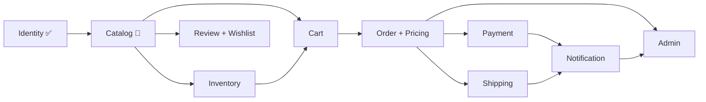

# Maison Parfait


> Maison Parfait is a fictional brand built as a personal portfolio project — a from-scratch, full-stack e-commerce rebuild used to practice modular backend architecture and phased, production-style frontend delivery. It's not a real business and isn't intended for public or commercial use.

E-commerce platform for a premium French patisserie. The backend is being rebuilt from scratch as a modular monolith, module by module, replacing an earlier prototype; the frontend follows the same phased approach, with each module's UI wired up once its backend lands.

## Preview

<table>
  <tr>
    <td></td>
    <td></td>
  </tr>
</table>

## Stack

- **Backend**: Spring Boot 4.1.0, Java 21, PostgreSQL, Flyway, Spring Security, JWT, Spring Modulith, MapStruct, Testcontainers
- **Frontend**: React 19, Vite, Tailwind CSS
- **Infra**: Docker Compose (Postgres, pgAdmin, backend)

## Architecture

The backend is a modular monolith rebuilt one module at a time, with each new module fully replacing its legacy counterpart before the old code is deleted. Full design decisions and rationale live in:

- [`docs/backend-architecture.md`](docs/backend-architecture.md) - overall module map, database design, payment/shipping abstractions, and the phased rebuild roadmap
- [`docs/identity-module-design.md`](docs/identity-module-design.md) - authentication, sessions, and token design for the identity module

Module dependency flow:



### Status

The **identity** module is complete on both ends. Backend: registration, email verification, login, JWT access tokens, refresh token rotation with reuse detection, per-device session management, forgot/reset/change password, email change, and basic rate limiting on the abuse-prone endpoints. Frontend: Login, Register, and Account pages wired to the real API, plus the email verification, forgot-password, and reset-password flows - all in the same visual design system as the original Home page.

The frontend also carries roadmap placeholders for not-yet-built modules (search, wishlist, cart) so the navigation and product cards already show where those features will live; they currently surface a "coming soon" toast instead of navigating anywhere. The cart icon's item count is real and persisted (`localStorage`), ready to be wired to an actual cart page once Phase 4 (Cart) lands.

| Phase | Module              | Backend    | Frontend   |
| ----- | -------------------- | ---------- | ---------- |
| 1     | Identity              | ✅ Done    | ✅ Done    |
| 2     | Catalog                | 🚧 Next    | 🚧 Next    |
| 3     | Inventory              | ⬜ Planned | ⬜ Planned |
| 4     | Cart                    | ⬜ Planned | ⬜ Planned |
| 5     | Order + Pricing        | ⬜ Planned | ⬜ Planned |
| 6     | Payment                | ⬜ Planned | ⬜ Planned |
| 7     | Shipping                | ⬜ Planned | ⬜ Planned |
| 8     | Review + Wishlist      | ⬜ Planned | ⬜ Planned |
| 9     | Notification            | ⬜ Planned | ⬜ Planned |
| 10    | Admin                    | ⬜ Planned | ⬜ Planned |

See `docs/backend-architecture.md` for the full rationale behind each phase.

## Running locally

### Backend + database

```bash
cd backend
docker compose up -d postgres      # Postgres on :5432
./mvnw spring-boot:run             # dev profile is the default; API on :8080
```

Or run the backend itself in a container too:

```bash
cd backend
docker compose up -d
```

API docs (Swagger UI) once running: `http://localhost:8080/swagger-ui.html`

### Frontend

```bash
cd frontend
cp .env.example .env               # sets VITE_API_URL=http://localhost:8080
npm install
npm run dev                        # http://localhost:5173
```

The backend's default dev CORS config already allows `http://localhost:5173`, so no extra setup is needed there.

### Tests

```bash
cd backend
./mvnw test                        # unit tests
./mvnw verify                      # includes Testcontainers-backed integration tests; requires Docker
```

## License

MIT - see [`LICENSE`](LICENSE).
