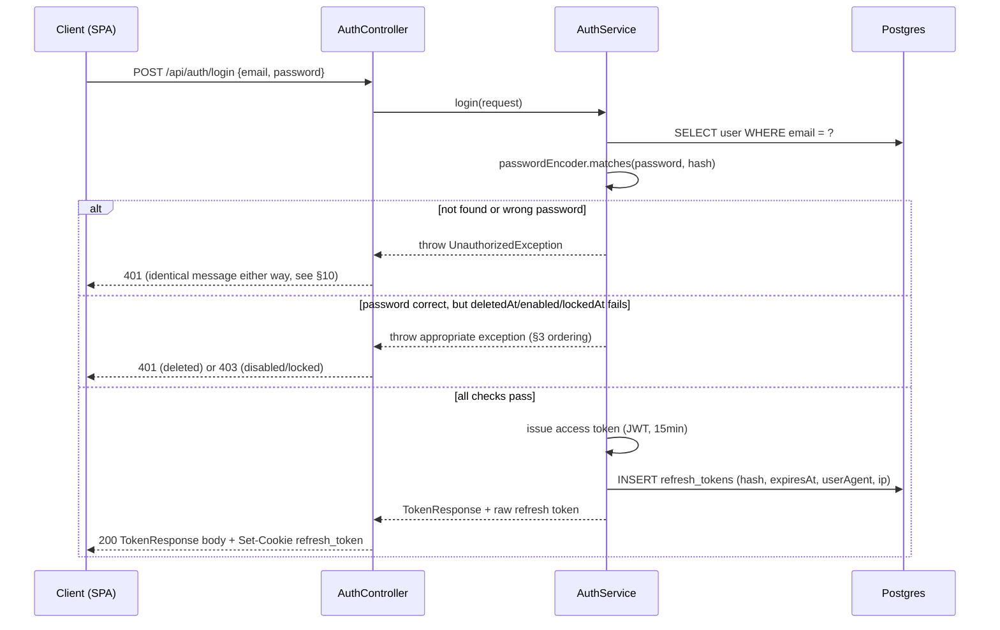
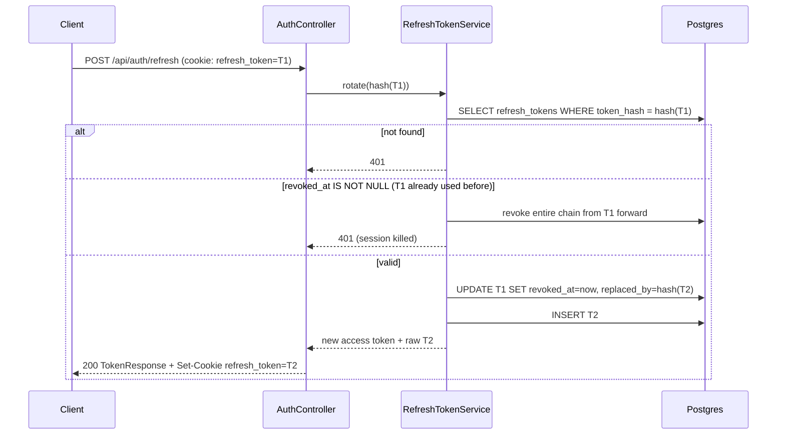

# Identity Module — Design Document

Status: **approved, incorporating review feedback — ready for implementation**
Replaces: `modules/auth`, `modules/user` (deleted once this lands, per the roadmap in [backend-architecture.md](backend-architecture.md))
Depends on: `common` only (one direction — see §2 for why that matters)

---

## 1. Scope

Identity owns: authentication, authorization primitives (`CurrentUser`, role), credentials, sessions/refresh tokens, email verification, password reset, email change, and account status (enabled / locked / soft-deleted).

Identity does **not** own: orders, wishlist, addresses, reviews, notification preferences, or any other business-domain data. Those modules will each hold their own `user_id` FK back to `users` and manage their own concerns — Identity never grows a "manage the customer" surface beyond who they are and how they authenticate. Where a capability might look like it belongs here (e.g. "list all customers" for an admin screen) it doesn't — that's the `admin` module reading Identity's data later, not Identity exposing an endpoint for it.

---

## 2. Package structure

New top-level package, **sibling to `common`, not nested under `modules`**:

```
com.zeynepates.maisonparfait.backend.identity/
├── User.java                          entity
├── UserRole.java                      enum: CUSTOMER, ADMIN
├── UserRepository.java
├── RefreshToken.java                  entity
├── RefreshTokenRepository.java
├── VerificationToken.java             entity
├── VerificationTokenType.java         enum: EMAIL_VERIFY, PASSWORD_RESET, EMAIL_CHANGE
├── VerificationTokenRepository.java
├── AuthController.java                register / login / refresh / logout / verify / reset
├── UserController.java                GET+PATCH /api/users/me, change-password, change-email, delete (self)
├── SessionController.java             GET+DELETE /api/users/me/sessions
├── AuthService.java                   orchestrates register/login/refresh/logout
├── TokenService.java                  JWT access-token issuance & parsing
├── RefreshTokenService.java           issue / rotate / revoke / reuse-detection
├── EmailVerificationService.java      handles EMAIL_VERIFY and EMAIL_CHANGE tokens
├── PasswordResetService.java
├── SessionService.java
├── EmailSender.java                   interface (§9 explains why this is here, not in a "notification" module yet)
├── LoggingEmailSender.java            dev-only impl: logs the email instead of sending one
├── RateLimiter.java                   small in-memory limiter for auth endpoints (§10)
├── config/
│   ├── SecurityConfig.java            moved from common.config, now identity's
│   └── JwtAuthenticationFilter.java   replaces common.config.JwtAuthFilter
├── mapper/
│   ├── UserMapper.java                MapStruct
│   └── SessionMapper.java             MapStruct
└── dto/
    ├── RegisterRequest.java
    ├── LoginRequest.java
    ├── TokenResponse.java
    ├── UserResponse.java
    ├── UpdateProfileRequest.java
    ├── ChangePasswordRequest.java
    ├── ChangeEmailRequest.java
    ├── ForgotPasswordRequest.java
    ├── ResetPasswordRequest.java
    ├── VerifyEmailRequest.java
    ├── ResendVerificationRequest.java
    └── SessionResponse.java
```

**Why `identity` owns `SecurityConfig`, not `common`**: `common.security.CurrentUser`/`AuditorAwareImpl`/`CurrentUserArgumentResolver` already exist from Phase 0. If `SecurityConfig` stayed in `common` and injected `identity.JwtAuthenticationFilter` by type, that would make `common → identity` at the same time `identity → common` (BaseEntity, CurrentUser, exceptions) — a module cycle, which is exactly what Spring Modulith's boundary check (deferred in Phase 0, but the reason it was deferred still applies going forward) would reject once it's checking real modules. Spring Security also doesn't decompose a single `SecurityFilterChain` cleanly across modules in practice — one bean ends up listing every path rule regardless. So the pragmatic, cycle-free choice is: `identity` owns the filter chain outright, `common` stays a leaf module that nothing depends *on it depending on*. Later modules (catalog, order, ...) will add their own path rules into `identity.config.SecurityConfig` as they're built, same as the legacy code already did in one file — that part of the shape isn't changing, just which module owns the file.

---

## 3. Entities

### `User` (maps to the existing `users` table)

| Field | Type | Notes |
|---|---|---|
| id | `Long` | numeric surrogate key, `bigserial` — no UUIDs anywhere in this module; nothing about JWTs, cookies, or the public API needs one |
| version, createdAt, updatedAt, createdBy, updatedBy | — | from `common.entity.BaseEntity` |
| email | String | unique **among active accounts** — see the partial-index note below |
| passwordHash | String | BCrypt, **nullable** — see §9 (OAuth readiness); null means "no local credential set" |
| fullName | String | not null for new rows; nullable at the DB level (existing rows) |
| role | `UserRole` | not null, default `CUSTOMER` |
| enabled | boolean | default true — admin-facing on/off switch, not a security lock |
| lockedAt | `OffsetDateTime` | nullable — set on an explicit lock (self-service brute-force lockout is *not* built now, see §10; this field exists so the `admin` module can lock an account later without a schema change) |
| emailVerifiedAt | `OffsetDateTime` | nullable |
| pendingEmail | String | nullable — set while an email-change is awaiting confirmation on the new address (§8) |
| deletedAt | `OffsetDateTime` | nullable — soft delete; a "deleted" user is never physically removed (§7) |

**Email uniqueness**: the legacy `unique` constraint on `email` becomes a **partial unique index** — `create unique index ux_users_email_active on users(email) where deleted_at is null`. A soft-deleted account's email frees up for a fresh registration; the deleted row itself is kept (and its email value stays on that row) for historical FK integrity (old orders still point at it).

**Login-time state checks happen in this order** — deliberately, because the order itself is a security property, not just a control-flow detail:

1. Look up by email. Not found → generic 401 (§10).
2. `passwordEncoder.matches(...)`. Wrong → generic 401 (§10).
3. *Only after the password has been proven correct* — `deletedAt != null` → generic 401 (a deleted account should look exactly like "never existed" to anyone who doesn't already know the password); `enabled = false` → 403 "account disabled"; `lockedAt != null` → 403 "account locked".

Checking password *before* revealing account state is the point: someone who doesn't know the password learns nothing about whether an account is disabled/locked/deleted, only someone who's already proven they know the credentials does.

### `RefreshToken`

| Field | Type | Notes |
|---|---|---|
| id, version, createdAt, updatedAt, createdBy, updatedBy | — | from `BaseEntity` |
| user | `User` (many-to-one) | not null |
| tokenHash | String | SHA-256 hex of the raw opaque token, unique, not null — **the raw token is never persisted** |
| expiresAt | `OffsetDateTime` | not null |
| revokedAt | `OffsetDateTime` | nullable |
| replacedByTokenHash | String | nullable — set when this token is rotated forward; used for reuse detection (§6) |
| userAgent | String | nullable, informational |
| ipAddress | String | nullable, informational |
| lastUsedAt | `OffsetDateTime` | nullable |

One row = one session/device. This is already the full per-device session model asked for: list active sessions, revoke one, revoke all — nothing further needed structurally, it's built into the shape from the start (§6).

### `VerificationToken`

| Field | Type | Notes |
|---|---|---|
| id, version, createdAt, updatedAt, createdBy, updatedBy | — | from `BaseEntity` |
| user | `User` (many-to-one) | not null |
| type | `VerificationTokenType` | EMAIL_VERIFY, PASSWORD_RESET, or EMAIL_CHANGE |
| tokenHash | String | SHA-256 hex, unique, not null |
| expiresAt | `OffsetDateTime` | not null — 24h for EMAIL_VERIFY/EMAIL_CHANGE, 30min for PASSWORD_RESET |
| usedAt | `OffsetDateTime` | nullable — single-use, checked on consumption |

No separate column for "the new email being confirmed" — that lives on `User.pendingEmail` instead (§8), so the token table's job stays uniform across all three types: prove the holder controls whatever this token was issued for.

---

## 4. DTOs (records)

```
RegisterRequest(String email, String password, String fullName)
LoginRequest(String email, String password, boolean rememberMe)
TokenResponse(String accessToken, String tokenType, long expiresInSeconds, UserResponse user)
UserResponse(Long id, String email, String fullName, String role, boolean emailVerified, String pendingEmail)
UpdateProfileRequest(String fullName)
ChangePasswordRequest(String currentPassword, String newPassword)
ChangeEmailRequest(String newEmail)
ForgotPasswordRequest(String email)
ResetPasswordRequest(String token, String newPassword)
VerifyEmailRequest(String token)
ResendVerificationRequest(String email)
SessionResponse(Long id, String userAgent, String ipAddress, OffsetDateTime createdAt, OffsetDateTime lastUsedAt, boolean current)
```

No `username` field anywhere — registration is exactly `fullName` + `email` + `password`, per the confirmed scope.

The refresh token itself never appears in any DTO — it only ever travels as an httpOnly cookie, set/read directly by the controller layer, not serialized through a response body.

---

## 5. REST endpoints

All new-module endpoints use the `/api/...` prefix (the legacy `/auth/**` bare-path inconsistency doesn't carry forward).

| Method | Path | Auth | Notes |
|---|---|---|---|
| POST | `/api/auth/register` | public | 201, `TokenResponse` body, sets refresh cookie. Auto-logs-in; verification email sent async |
| POST | `/api/auth/login` | public | 200, `TokenResponse`, sets refresh cookie |
| POST | `/api/auth/refresh` | refresh cookie | 200, new `TokenResponse`, rotates refresh cookie |
| POST | `/api/auth/logout` | refresh cookie | 204, revokes that one refresh token, clears cookie |
| POST | `/api/auth/verify-email` | public | body `VerifyEmailRequest`, 204. Dispatches on the token's stored `type` — handles both the original registration EMAIL_VERIFY *and* an EMAIL_CHANGE confirmation with one endpoint (§8) |
| POST | `/api/auth/resend-verification` | public | body `ResendVerificationRequest`, always 202 |
| POST | `/api/auth/forgot-password` | public | body `ForgotPasswordRequest`, always 202 (enumeration-safe, §10) |
| POST | `/api/auth/reset-password` | public | body `ResetPasswordRequest`, 204, revokes **all** refresh tokens for that user |
| GET | `/api/users/me` | bearer | 200, `UserResponse` |
| PATCH | `/api/users/me` | bearer | body `UpdateProfileRequest`, 200, `UserResponse` |
| POST | `/api/users/me/change-password` | bearer | body `ChangePasswordRequest`, 204, revokes all *other* sessions |
| POST | `/api/users/me/change-email` | bearer | body `ChangeEmailRequest`, 202 — does not change `email` yet, sets `pendingEmail` and sends a confirmation to the *new* address (§8) |
| DELETE | `/api/users/me` | bearer | 204 — soft-deletes the caller's own account (`deletedAt = now`), revokes all sessions |
| GET | `/api/users/me/sessions` | bearer | 200, `List<SessionResponse>` |
| DELETE | `/api/users/me/sessions/{id}` | bearer | 204 — revokes one session. Scoped by `WHERE user_id = :callerId` at the repository layer, so a foreign session id 404s rather than needing a separate ownership check (§11) |
| DELETE | `/api/users/me/sessions` | bearer | 204 — revokes all sessions **except** the one used for this request |

No admin user-management endpoints here (list/disable/lock customers) — that's the `admin` module's job later, per the roadmap. Identity exposes `enabled`/`lockedAt`/`deletedAt` on the domain and internal service methods to flip them; nothing in this phase surfaces an HTTP endpoint for an admin to call them.

---

## 6. Authentication flow

**Access token**: JWT, HS256, 15 min TTL. Subject = `user.id` (numeric, not email — an email change shouldn't invalidate live tokens, and this also sidesteps re-keying anything if email changes mid-session). Claims: `role`, `emailVerified`. Returned in the `TokenResponse` body; the frontend holds it in memory only, sent as `Authorization: Bearer <token>`.

**Refresh token**: opaque 256-bit random value, base64url-encoded. Server stores only its SHA-256 hash. Delivered as `Set-Cookie: refresh_token=...; HttpOnly; Secure; SameSite=Lax; Path=/api/auth`. TTL 7 days normally, 30 days if `rememberMe=true` at login.



---

## 7. Refresh token rotation & session management

Every successful `/api/auth/refresh` call **rotates**: issues a brand-new refresh token, marks the presented one `revokedAt = now`, `replacedByTokenHash = hash(new token)`, and sets the new cookie. The old token can never be used again.

**Reuse detection**: if an already-revoked refresh token is presented again, that's not a normal client mistake — a legitimate client always uses the newest token it was given, so replaying an old one means it was captured (XSS, log leakage, a stale copy on another device) and is now racing the real client. Response: walk the `replacedByTokenHash` chain forward and revoke every token in the lineage, i.e. kill the *entire* session, not just decline the one bad request.



`GET /api/users/me/sessions` lists non-revoked, non-expired `refresh_tokens` rows for the caller (user agent, IP, created/last-used timestamps — not the token itself), with `current` flagging whichever row matches the refresh cookie on *this* request. `DELETE .../sessions/{id}` and `DELETE .../sessions` are just targeted or bulk `revoked_at = now` updates, scoped to the caller's own rows. This is the full "see active sessions, revoke one, revoke all" model asked for — nothing about it needs to change later, it was designed in from the start.

"Remember me" is purely a longer `expiresAt` chosen at login — no separate mechanism.

---

## 8. Email verification, password reset, and email change

All three reuse the same `VerificationToken` mechanism: random 32-byte token, SHA-256 hashed at rest, single-use via `usedAt`, short TTL.

```mermaid
sequenceDiagram
    participant C as Client
    participant A as AuthController
    participant EV as EmailVerificationService
    participant ES as EmailSender
    participant DB as Postgres

    C->>A: POST /api/auth/register {...}
    A->>EV: (via AuthService) after user created
    EV->>DB: INSERT verification_tokens (EMAIL_VERIFY, 24h TTL)
    EV->>ES: send(email, "Verify your email", link with raw token)
    Note over A,C: registration response returns immediately;<br/>email send does not block it
    C->>A: POST /api/auth/verify-email {token}
    A->>EV: verify(token)
    EV->>DB: SELECT WHERE token_hash = hash(token) AND used_at IS NULL AND expires_at > now
    alt valid, type = EMAIL_VERIFY
        EV->>DB: UPDATE users SET email_verified_at = now
        EV->>DB: UPDATE verification_tokens SET used_at = now
        A-->>C: 204
    else valid, type = EMAIL_CHANGE
        EV->>DB: UPDATE users SET email = pending_email, pending_email = null, email_verified_at = now
        EV->>DB: UPDATE verification_tokens SET used_at = now
        A-->>C: 204
    else invalid/expired/used
        A-->>C: 400
    end
```

**Password reset** is the same token mechanism with `type = PASSWORD_RESET`, 30 min TTL, and one extra step: on successful reset, **every refresh token for that user is revoked** — a password reset is frequently a response to suspected compromise, so all existing sessions should die and force re-login.

**Email change** (`POST /api/users/me/change-email`, requires being logged in):
1. Validate `newEmail` isn't already taken by an active account (same partial-unique-index rule as registration).
2. Set `User.pendingEmail = newEmail` (the *current* `email` is untouched, so login/JWT/everything else keeps working exactly as before during the pending window).
3. Issue a `VerificationToken(type = EMAIL_CHANGE)` and email the confirmation link **to the new address** — this is the step that actually proves the user controls it, which is the entire point of the flow.
4. Also send a plain heads-up notice to the *old* address ("your email is being changed to X — if this wasn't you, reset your password"). No new schema for this, just a second `EmailSender.send(...)` call — cheap defense-in-depth against an attacker with a stolen session trying to quietly take over the account by rerouting future password-reset emails.
5. Confirming (via the same `/api/auth/verify-email` endpoint, dispatched by token type) moves `pendingEmail` into `email` and clears it.

Unlike password reset, confirming an email change does **not** revoke other sessions — the change was requested by an already-authenticated legitimate session in the first place, there's no compromise signal here to respond to.

`POST /api/auth/forgot-password` and `POST /api/auth/resend-verification` **always return 202**, whether or not the email exists — the only place this module intentionally reveals account existence is registration's "email already taken" 409, which is normal, expected UX for a signup form and not treated as an enumeration risk the same way login/reset are.

---

## 9. OAuth readiness (not implemented now)

No OAuth provider is being built in this phase. Two decisions made now specifically so adding Google/GitHub/Apple later doesn't require touching the parts of this module that already work:

1. **`passwordHash` is nullable.** A future OAuth-created account has no local password at all — `User` already accommodates that without a schema change. A password-login attempt against such an account fails with the same generic 401 as a wrong password (§10) — never a distinguishing "this account uses Google sign-in" message, which would itself be an enumeration leak.
2. **Token issuance is already provider-agnostic.** `login()` in the sequence diagram above ends by calling the same `issueTokenPair(user, ...)` that a future `loginWithOAuth(provider, providerUserId)` would also call once it's resolved which `User` row the external identity maps to. Access tokens, refresh tokens, and sessions don't know or care how the caller proved who they are — only the "prove it" step at the front is provider-specific.

What a future OAuth phase would add (not built now, no code or schema for this yet): an `oauth_accounts` table (`user_id`, `provider`, `provider_user_id`, unique on `(provider, provider_user_id)`) linking one `User` to one or more external identities, and a parallel `loginWithOAuth` entry point in `AuthService` that finds-or-creates a `User` row by that lookup before handing off to the same shared token issuance. Nothing in today's design needs to anticipate that table's exact shape — the two decisions above are the only load-bearing ones.

---

## 10. Security considerations

- **Login timing side-channel**: the naive pattern (`findByEmail(...).orElseThrow(...)` before ever calling `passwordEncoder.matches`) makes a nonexistent-email request measurably faster than a wrong-password one, since BCrypt's deliberate slowness is skipped entirely on the "not found" path. Fix: when the user isn't found, still run `passwordEncoder.matches(password, DUMMY_HASH)` against a precomputed constant hash before returning 401, so response timing doesn't leak whether the email is registered.
- **Enumeration**: login and password-reset-request give identical responses regardless of account existence. Account-state checks (disabled/locked/deleted) only ever happen *after* a correct password is supplied (§3), so they can't be used to probe account existence either.
- **Rate limiting**: login, forgot-password, and resend-verification are the natural brute-force/abuse targets. Rather than pulling in Bucket4j + Redis for three endpoints on a single-instance deployment, `RateLimiter` is a small `ConcurrentHashMap`-backed fixed-window counter (key = email or IP+email, e.g. 5 attempts / 15 min), with a scheduled sweep to evict expired windows. Explicitly a v1 approach — good enough for a single instance, and worth revisiting with Bucket4j/Redis only if this ever runs multi-instance. This is deliberately separate from `lockedAt`: rate limiting is transient and self-clears after the window; `lockedAt` is a persistent, explicit state that only an admin action clears. Automatically escalating repeated rate-limit hits into a persistent lock isn't built now — that's an anti-abuse policy decision better made once the `admin` module exists to manage it.
- **CSRF**: every endpoint except `/api/auth/refresh` and `/api/auth/logout` is bearer-token-only, so CSRF doesn't apply to them. Those two are the only cookie-driven endpoints; `SameSite=Lax` is the primary defense, scoped `Path=/api/auth` limits the cookie's blast radius even further.
- **Token storage discipline**: raw refresh/verification tokens are never logged, never persisted — only their SHA-256 hash is. The JWT signing secret comes from `${JWT_SECRET}` (already externalized in Stage 1) with no default in the prod profile.
- **Account state enforcement is login/refresh-time, not per-request**: `enabled`/`lockedAt`/`deletedAt` are checked when a token is issued or refreshed, not re-checked on every single bearer-authenticated request — consistent with the short-lived-access-token trade-off already inherent in this design (worst case, a just-disabled account's existing access token keeps working for up to 15 more minutes). Re-checking on every request would mean a DB hit per request, defeating the point of a stateless access token, for a marginal reduction of an already-small window.

---

## 11. Database schema

The legacy `users` table (from `V1__init.sql`) is **not** dropped and recreated — `orders`, `addresses`, and `payments` all hold live FKs into it, and those modules aren't being rewritten in this phase. The new `identity.User` entity maps to the same physical `users` table; the migration **alters** it:

```sql
-- V8__identity_users.sql
alter table users
    add column if not exists version bigint not null default 0,
    add column if not exists full_name varchar(150),
    add column if not exists enabled boolean not null default true,
    add column if not exists locked_at timestamptz,
    add column if not exists email_verified_at timestamptz,
    add column if not exists pending_email varchar(255),
    add column if not exists deleted_at timestamptz,
    add column if not exists created_by bigint references users(id),
    add column if not exists updated_by bigint references users(id),
    alter column password_hash drop not null;

-- Replace the plain unique constraint on email with a partial one that
-- excludes soft-deleted rows (exact existing constraint name to be
-- confirmed against the live DB at implementation time).
alter table users drop constraint if exists users_email_key;
create unique index if not exists ux_users_email_active
    on users(email) where deleted_at is null;

-- V9__identity_tokens.sql
create table refresh_tokens (
    id bigserial primary key,
    version bigint not null default 0,
    user_id bigint not null references users(id) on delete cascade,
    token_hash varchar(64) not null unique,
    expires_at timestamptz not null,
    revoked_at timestamptz,
    replaced_by_token_hash varchar(64),
    user_agent varchar(255),
    ip_address varchar(64),
    last_used_at timestamptz,
    created_at timestamptz not null default now(),
    updated_at timestamptz not null default now(),
    created_by bigint references users(id),
    updated_by bigint references users(id)
);
create index idx_refresh_tokens_user_id on refresh_tokens(user_id);
create index idx_refresh_tokens_expires_at on refresh_tokens(expires_at);

create table verification_tokens (
    id bigserial primary key,
    version bigint not null default 0,
    user_id bigint not null references users(id) on delete cascade,
    type varchar(30) not null check (type in ('EMAIL_VERIFY', 'PASSWORD_RESET', 'EMAIL_CHANGE')),
    token_hash varchar(64) not null unique,
    expires_at timestamptz not null,
    used_at timestamptz,
    created_at timestamptz not null default now(),
    updated_at timestamptz not null default now(),
    created_by bigint references users(id),
    updated_by bigint references users(id)
);
create index idx_verification_tokens_user_id_type on verification_tokens(user_id, type);
```

This is illustrative of the intended shape, not the final migration text — actual `V__` numbering depends on where the squash-to-baseline (architecture doc §0) stands when this phase is implemented.

---

## 12. Authorization model

Roles stay `CUSTOMER`/`ADMIN` (unchanged from legacy), enforced via `hasRole(...)` in `SecurityConfig` for admin-only paths — none exist in Identity itself yet.

**No generic ownership-check abstraction in this module.** Every Identity endpoint that touches "my own" data (`/api/users/me/**`) takes no foreign id from the caller at all — the id always comes from the authenticated `CurrentUser`, and repository queries are scoped by it directly (`findByIdAndUserId(id, currentUser.id())`), so there's no separate id to compare against and nothing an `Ownership` bean would add. That abstraction becomes genuinely necessary in Phase 5 (order/address), where endpoints like `/api/addresses/{id}` **do** take a foreign id that must be checked against the caller — building it now, before there's a real second use case, would be exactly the kind of speculative infrastructure to avoid. It'll be introduced then, in `common`, and Identity won't need to change to use it.

`CurrentUser(Long id, String role)` — populated by `identity.config.JwtAuthenticationFilter` as the `Authentication` principal after validating the bearer token, which is exactly what `common.security.AuditorAwareImpl` and `CurrentUserArgumentResolver` (built in Phase 0, unused until now) were built to consume. This is the module that finally closes that loop.

---

## 13. Open decisions worth confirming before I implement

1. **Email sending for v1**: `EmailSender` interface with a `LoggingEmailSender` (logs the verification/reset/change link instead of sending real email) — good enough to build and test every flow now, real SMTP/provider integration deferred to the `notification` module (Phase 9). Confirm this is acceptable rather than wiring real email now.
2. **`fullName` required at registration**: adds one required field to the signup form beyond email/password. Confirm the frontend registration form (not built yet) should collect it, since it's used in verification/reset/change email greetings.
3. **Rate limiting scope**: in-memory only, three endpoints (login, forgot-password, resend-verification). Confirm that's sufficient for now versus wanting it on more endpoints (e.g. register, to blunt account-creation spam, or change-email) — a cheap addition either way, no new dependency required.
